# Traditional Homes Repo Wireframe

## Purpose

This document records a quick architecture map of the current Astro website structure. It is intended as a lightweight reference for future agents and Codex sessions before making changes to routes, content collections, property data, media, maps, or the contact backend.

The diagram was generated from Graphify and repo structure analysis. It is a structural guide, not a complete dependency graph.

## Mermaid Preview

```mermaid
flowchart TD
  root["traditional-homes Astro site"]

  root --> config["Build config<br/>astro.config.mjs<br/>tailwind.config.js<br/>package.json"]
  root --> src["src/"]
  root --> public["public/"]
  root --> functions["functions/"]
  root --> tests["tests/"]
  root --> docs["docs/"]
  root --> scripts["scripts/"]
  root --> agents[".agents/skills/"]

  src --> pages["pages/<br/>route files"]
  src --> layouts["layouts/<br/>Base.astro"]
  src --> components["components<br/>cards, maps, gallery, booking"]
  src --> content["content<br/>houses, villa, blog"]
  src --> inventory["inventory<br/>inventory.json, groups, pairings"]
  src --> i18n["i18n<br/>locale config, route map, routes, translations, selector + SEO helpers"]
  src --> data["data<br/>siteCopy, gallery, locations"]
  src --> utils["utils<br/>validation, gallery sorting, filters, maps"]
  src --> styles["styles/global.css"]
  src --> assets["assets/images/"]

  pages --> base["Base layout"]
  base --> header["Header"]
  base --> footer["Footer"]
  base --> mobileBooking["Mobile booking bar"]
  base --> i18n
  header --> languageSelector["EN/DE language selector<br/>equivalent route or target-locale home"]
  languageSelector --> i18n

  pages --> rootRedirect["/ redirects to /en/"]
  pages --> notFound["/404.html<br/>custom not-found fallback"]
  pages --> home["/en/"]
  pages --> collection["/en/houses/"]
  pages --> houseDetail["/en/houses/[slug]/"]
  pages --> villaDetail["/en/villa/[slug]/<br/>shared VillaDetailPage renderer"]
  pages --> blogRoutes["/en/blog/ + /en/blog/[slug]<br/>/blog/** redirects (301)"]
  pages --> infoPages["about, faq, policies, location, contact, guides<br/>shared renderers, EN + DE thin wrappers"]
  pages --> guidePilot["/en/guide/[place]/ + /de/reisefuehrer/[place]/<br/>shared GuidePage renderer (Vrouchas + Mavrikiano)"]
  guidePilot --> guidePage["components/pages/GuidePage.astro"]
  pages --> sharedRenderers["components/pages/<br/>HomePage, CollectionPage, LocationPage, HouseDetailPage,<br/>VillaDetailPage, GuidePage, AboutPage, ContactPage, FaqPage, PoliciesPage"]
  sharedRenderers --> i18n
  pages --> deCluster["/de/ + /de/ferienhaeuser/ + /de/ferienhaeuser/[slug]/ + /de/villa/[slug]/ + /de/lage/<br/>/de/ueber-uns/ + /de/kontakt/ + /de/faq/ + /de/richtlinien/ + /de/reisefuehrer/[place]/<br/>whole German site except the blog (thin wrappers)"]
  deCluster --> sharedRenderers
  guidePage --> i18n

  home --> inventory
  collection --> inventory
  collection --> groups["groups.json"]
  collection --> filterBar["FilterBar"]
  collection --> unitCard["UnitCard / GroupCard"]

  houseDetail --> inventory
  houseDetail --> content
  houseDetail --> galleryData["gallery.json"]
  houseDetail --> locations["locations.ts"]
  houseDetail --> houseGallery["HouseGallery"]
  houseDetail --> atAGlance["AtAGlance"]
  houseDetail --> singleMap["SinglePinMap"]

  villaDetail --> inventory
  villaDetail --> content
  villaDetail --> galleryData
  villaDetail --> singleMap

  blogRoutes --> content
  docs --> blogResearch["research/blog/&lt;slug&gt;<br/>brief, sources, claims"]
  agents --> blogSkill["blog-research-article"]
  blogResearch --> blogSkill
  blogSkill --> content
  scripts --> blogRun["blog/<br/>scaffold + read-only status"]
  blogRun --> localRuns[".blog-runs/&lt;run-id&gt;<br/>ignored operational state"]
  blogRun --> blogResearch
  scripts --> blogValidator["validate-blog-article.mjs"]
  content --> blogValidator
  blogValidator --> blogChecks["tests + typecheck + build<br/>draft PR"]
  blogRun --> blogChecks
  location["/en/location/"] --> masterMap["MasterLocationMap"]
  masterMap --> leaflet["LeafletMap"]
  singleMap --> leaflet

  contact["/en/contact/"] --> apiContact["/api/contact"]
  functions --> apiContact
  apiContact --> cloudflareEmail["Cloudflare Email REST API"]

  i18n --> routeMap["route-map.ts<br/>internal route ids to localized public paths"]
  i18n --> languageSwitcher["language-switcher.ts<br/>real-locale visibility + route-aware switching"]
  i18n --> enLocale["English locale JSON<br/>common, navigation, forms, seo, guide"]
  i18n --> deLocale["German locale JSON overlay<br/>partial, falls back to English"]

  public --> publicImages["images<br/>houses, villa, blog, about, brand"]
  public --> fonts["fonts/"]
  public --> favicons["favicons / manifest / redirects / headers"]
```

## Notes For Agents

- Treat `src/inventory/inventory.json` as the source of truth for property facts.
- Treat `docs/i18n/00_I18N_MASTER_PLAN.md` as the control document before multilingual route, page, or translation work.
- Stage 1 i18n foundation lives under `src/i18n/` and currently provides English-first shared UI strings, locale metadata, real-route mapping, and route-aware language switching.
- `src/i18n/language-switcher.ts` exposes only launched locales, switches to an equivalent localized route when one exists, and otherwise uses the target locale homepage rather than fabricating a URL.
- Property and villa routes combine structured inventory, Markdown content, gallery data, location data, and shared components.
- `src/pages/404.astro` exists so missing static routes, including not-yet-created locale-prefixed paths, return a not-found page instead of the root redirect stub.
- Public URL assets live under `public/`; imported image assets live under `src/assets/images/`.
- The contact form posts to `/api/contact`, handled by `functions/api/contact.js`.
- This document is documentation-only and should not be used as a reason to refactor runtime code.

## File Locations

- Mermaid source: `docs/architecture/repo-wireframe.mmd`
- Markdown reference: `docs/architecture/repo-wireframe.md`
- Related architecture docs: `docs/architecture/`
