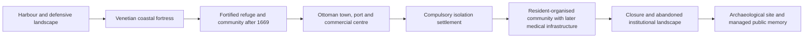
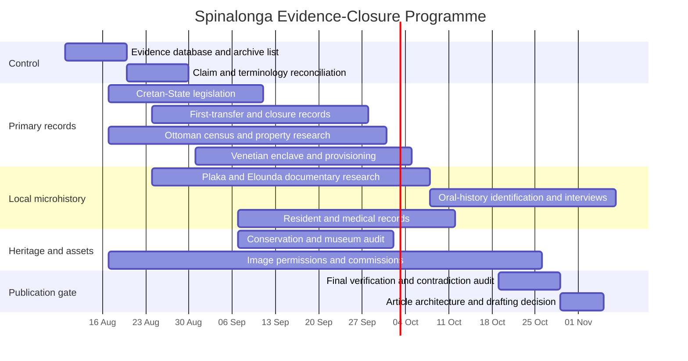

<!--
Original filename: chatgpt-spinalonga-dossier.md
Date received: 2026-08-05
Producing system: ChatGPT
Classification: Accepted substantive secondary research synthesis; not a primary source.
Citation warning: Internal AI-tool citation markers are not portable evidence.
Requirement: Important claims must be traced to the identifiable underlying document before public use.
-->

# Spinalonga Research Audit and Publication-Readiness Report

## Executive assessment and recovered brief

The requested source file was located. Its filename is **“Pasted text(18).txt”**, rather than a filename beginning with “You are conducting,” but its first words are exactly **“You are conducting archival, architectural, medical-historical and local microhistory research…”** The full prompt concerns a future historical article for Traditional Homes about Spinalonga and explicitly prohibits drafting the public article at this stage. fileciteturn0file9

The attached Papantou tobacco-warehouse study establishes the analytical model: treat one physical site as a structure whose meaning, internal organisation, users and relationship to the surrounding city changed with each successive use. Applied to Spinalonga, the correct unit of analysis is therefore not a simple chronological sequence but the repeated transformation of one island landscape from defensive position to fortress, settlement, compulsory institution, abandoned landscape and managed heritage site. fileciteturn0file0

The existing research packet is a competent preliminary dossier, particularly for the Venetian construction sequence and current heritage status. It is not yet sufficient for publication. Its principal weaknesses are the absence of original Cretan-State legislation, incomplete Ottoman demographic and property evidence, insufficient resident and mainland voices, uncertain numerical claims, unresolved naming questions, and the lack of any image cleared for commercial reuse. fileciteturn0file4 fileciteturn0file6 fileciteturn0file7

The central baseline is broadly sound:

| Baseline statement | Assessment | Qualification |
|---|---|---|
| Fortress construction began in 1579 | **Confirmed** | The Ephorate specifies June 1579. The surviving complex is the result of several later phases, so “built in 1579” is too compressed. citeturn9search6 |
| Genese Bressani and Latino Orsini were connected to separate phases | **Confirmed** | Bressani proposed the lower coastal enclosure; Orsini’s 1584 review led to a second defensive line along the ridge, begun in 1585. Neither should be called the sole architect. citeturn9search6 |
| Ottoman forces took the island in 1715 | **Confirmed** | The official date is 4 October 1715, after a siege of approximately three months. citeturn9search2turn10search13 |
| Legal selection as a leprosy settlement occurred in 1903 | **Confirmed with qualification** | Law 463 is consistently identified as dated 30 May 1903 and published in the Official Gazette of the Cretan State on 7 June 1903, but the original Gazette facsimile has not yet been obtained and checked directly. citeturn6view0 |
| First residents arrived in 1904 | **Confirmed with qualification** | October 1904 is well supported. A secondary medical-history paper reports 251 people and 13 October but prints “1903” in the body despite defining the operational phase as beginning on 13 October 1904; the exact date and count therefore require the original transfer record. citeturn6view1 |
| Closure occurred in 1957 | **Confirmed** | The institution ceased operating in 1957; secondary legal research identifies Legislative Decree 3766, Government Gazette 197/A/30 September 1957, article 4, as the formal abolition. Exact transfer dates should still be confirmed from administrative files. citeturn6view2 |
| Spinalonga is on the UNESCO Tentative List and is not a World Heritage Site | **Confirmed** | It remains displayed on Greece’s Tentative List, submitted in 2014. Its 2021 nomination was withdrawn at Greece’s request and it has not been inscribed. citeturn7search0turn16search0 |

**Publication decision:** the project is not ready for final article drafting. It is ready for a controlled second research phase focused on a finite set of primary-document and rights-clearance tasks.

### Extracted project definition

| Field | Extracted position |
|---|---|
| **Primary objective** | Produce the evidence base for an explanatory historical article on why Spinalonga was fortified, how its uses changed, who lived and worked there, how it depended on Elounda and Plaka, how buildings were reused, and how the site has been represented and remembered. fileciteturn0file9 |
| **Secondary objective** | Audit and independently verify the existing Codex packet rather than accepting it as authoritative. fileciteturn0file9 |
| **Geographical scope** | Spinalonga, Elounda, Plaka, Mirabello and the Gulf of Elounda. General histories of Venice, the Ottoman Empire, leprosy or tourism are out of scope unless they explain a local transformation. fileciteturn0file9 |
| **Chronological scope** | Pre-Venetian occupation through contemporary archaeological management and public memory. |
| **Stakeholders** | Traditional Homes and its readers; the Ephorate of Antiquities of Lasithi and Ministry of Culture; archives and image-rights holders; former residents and their families; communities in Plaka and Elounda; local boat operators and workers; historians, archaeologists and medical historians. |
| **Required deliverables** | Twenty-three research outputs, including chronology, geographical and architectural analysis, legal and medical history, people and claim registers, website overlap review, image-rights register, unresolved questions, recommended architecture and publication-readiness assessment. fileciteturn0file9 |
| **Excluded deliverable** | The final public website article. |
| **Original timeline** | **Unspecified.** |
| **Original budget** | **Unspecified.** |
| **Article word limit** | No fixed maximum; eventual length should follow the verified evidence. |
| **Evaluation criteria** | Primary-source strength, accurate attribution, reconciliation of contradictions, respectful terminology, local mainland connections, avoidance of sensational claims, commercial image clearance, clear separation from visitor-guide intent, and an explicit publication gate. |
| **Language requirements** | Research in Greek and English, with Italian or French where relevant; requested report in English. |
| **Critical constraints** | No invented scenes, motives or dialogue; no Wikipedia, generic tourism pages or unsourced blogs for central claims; no redirects without indexation and backlink evidence; no assumption that an online historical image is reusable commercially. fileciteturn0file9 |

## Methodology and evidence model

All ten supplied files were loaded and reviewed. The original prompt was reconstructed from the text file; the Papantou study was used only as an analytical model; and the Codex dossier, source bibliography, claim register, people register, image-rights register, overlap assessment, article architecture and unresolved-question register were treated as hypotheses and audit material rather than final authorities. fileciteturn0file0 fileciteturn0file1 fileciteturn0file2 fileciteturn0file3 fileciteturn0file4 fileciteturn0file5 fileciteturn0file6 fileciteturn0file7 fileciteturn0file8 fileciteturn0file9

The web investigation prioritised the Ephorate of Antiquities of Lasithi, Greek Ministry of Culture, UNESCO records, published Government Gazette references, peer-reviewed medical history, university and institutional repositories, and historical field material. Searches were run in English and Greek. Italian material was used where it added architectural context; French-language official material was checked where relevant. Tourism sources were excluded from evidentiary support for central claims.

The evidence was graded as follows:

| Grade | Meaning | Publication use |
|---|---|---|
| **Primary or official-direct** | Original law, Gazette, archive record, official monument description, official UNESCO decision or verified inscription | May anchor precise wording, subject to institutional bias and date |
| **Strong scholarly** | Peer-reviewed study or archival scholarship with identifiable references and page numbers | May support factual synthesis; numerical claims should still be traced to the cited original where practicable |
| **Official interpretive** | Ephorate or Ministry summary without the underlying archival edition | Strong for monument description and current institutional interpretation; weaker for contested motives or numbers |
| **Secondary lead** | Newspaper, local history, oral-history summary or later synthesis | Useful for identifying records and people; not sufficient alone for contentious claims |
| **Unverified repetition** | Tourism copy, fiction-derived narrative or source-free online claim | Exclude until independently demonstrated |

The Papantou-derived analytical matrix was applied to each phase:

| Analytical question | Application to Spinalonga |
|---|---|
| **Purpose** | What political, military, commercial, medical or heritage problem was the island expected to solve? |
| **Users** | Who occupied, administered, supplied, worked in or moved through the site? |
| **Material organisation** | Which walls, houses, shops, gates, cisterns, religious buildings, wards or roads were built, altered, demolished or reused? |
| **Mainland dependency** | What could not be provided on the island and therefore had to come through Elounda, Plaka or wider Mirabello? |
| **Power and control** | Who controlled access, residence, property, movement, health policy and historical interpretation? |
| **Public memory** | Which phase has been highlighted, marginalised or physically removed by later conservation and interpretation? |

This framework prevents two common errors. First, it prevents the island from being reduced to a sequence of ruling regimes. Second, it prevents its leprosy-settlement period from being presented only as suffering: the report must examine state coercion, material deprivation, social organisation, work, relationships and residents’ collective agency together.

**Research limits.** This investigation could verify the existence and metadata of several laws and decrees but did not obtain all original Gazette page images. It could not perform in-person archival work in Heraklion, Athens, Venice or Ottoman archives. It also could not establish permissions from rights holders. Exact legal language, several population figures, transport records, personal testimonies and image licences therefore remain open.

## Findings across successive uses

### Strategic geography before the Venetian fortress

Spinalonga occupies the mouth of Elounda’s natural harbour. The strategic significance lies in the relationship among the sheltered inner gulf, the wider Mirabello approaches, the mainland coast, the peninsula commonly associated with Kolokytha or “large Spinalonga,” and the shore opposite Plaka. Early twentieth-century field notes by R. M. Dawkins similarly describe the bay as a deep harbour protected by a long peninsula and identify Elounda, Mavrikiano and Plaka as a continuous mainland sequence facing the maritime approach. citeturn6view8

Ancient Olous belongs to the regional context, but it must not be used to manufacture an unsupported ancient fortress narrative for the islet. The Ephorate identifies Olous near Poros as a maritime city-state, with archaeological evidence for trade, fishing, olive cultivation and whetstone extraction. It also reports ancient ritual and habitation evidence on the broader Spinalonga peninsula or island area. This demonstrates long-term use of the regional landscape, not necessarily a Hellenistic fortress on the present fortified islet. citeturn9search0

The most important correction to the Codex baseline is the chronology of the earlier wall on Spinalonga. UNESCO’s 2014 Tentative List text says the islet was fortified in antiquity to protect Olous, whereas the Ephorate’s current interpretation places the surviving earlier fortification in the seventh or eighth century CE, associating it with defence against Arab maritime pressure and with the fortified acropolis at Oxa. Until the specialist excavation or architectural report is obtained, the safest wording is that an earlier wall exists and is currently interpreted by the Ephorate as Early Byzantine rather than securely ancient. citeturn7search0turn9search0

### Venetian fortification and post-1669 community

Construction began in June 1579. Bressani’s first scheme followed the shore with a lower enclosure, strengthened by bastions and works intended to prevent landing. Orsini’s 1584 assessment concluded that this scheme left important vulnerabilities; work on a second line along the ridge began in 1585. Financial constraints curtailed the programme after 1586, while the Cretan War brought later, more expedient raising and alteration of walls, embrasures and perimeter defences. citeturn9search6turn9search10

The island was not simply a detached fort. The Michiel demi-lune controlled the northern harbour entrance with seven cannon openings; the coastal enceinte included the Tiepolo and Donato bastions, the Scaramella semi-bastion and other defensive elements; powder magazines were tied to rainwater collection; and soldiers’ quarters, gates and cisterns supported prolonged occupation. citeturn9search10turn9search12turn9search13

The fortification decision belongs to a combined regional system: control of a sheltered naval harbour, reduction of raiding, protection of movement and settlement around Mirabello, and the broader Venetian response to Ottoman expansion. Salt production formed part of the local economic landscape, but the presently reviewed sources do not prove that protection of the salt pans was the single or principal decision-making cause. The future article should say the salt pans contributed to the value of the region, not that they alone caused the fortress to be built. citeturn9search2turn12search5

After Candia surrendered in 1669, Spinalonga remained one of Venice’s retained fortified bases. The official account describes refugees and anti-Ottoman fighters using the island and says it changed from a principally military fort into a settlement with several hundred inhabitants. This phase is important because it shows that the island’s defensive architecture became the physical support for a displaced and politically exposed community. Its supply system, civilian population and contacts with Ottoman-controlled mainland Crete remain under-researched. citeturn9search2

### Ottoman town and commercial landscape

The surrender on 4 October 1715 ended Venetian rule. Muslim soldiers and families began settling after repairs, and the island subsequently developed as a customs point, harbour settlement and commercial centre serving southeastern Aegean traffic. Official historical summaries identify trade in salt, leather, honey, wax, grindstones, silk, carobs and oil, but the exact scale and frequency of these trades should be verified against customs and property records. citeturn10search13turn7search0

The Ottoman period must be presented as an urban and social phase, not as a gap between fortress and leprosy institution. Houses occupied the western and southern slopes in stepped form; streets and narrow passages organised at least eight districts; shops and cafés concentrated along the central route and harbour edge; a mosque occupied the former Catholic church site; and burial grounds existed on the island, on the opposite shore near present-day Plaka and on the peninsula. citeturn10search4turn10search5turn10search6

The Ephorate states that records for 1879–1904 identify 103 merchants, 12 retailers, 19 grocers, six butchers, 15 coffee sellers, nine shoemakers and three tobacco processors or sellers. These figures strongly challenge the image of an empty military shell, but the record series and individual entries should be identified before the statistics are used in a public article. citeturn10search0

UNESCO’s nomination text reports 1,112 residents in 1881 and approximately 200 houses and 25 shops or workshops toward the end of the nineteenth century. Because that text is a State Party nomination rather than a census edition, the figures should be attributed to the nomination until the 1881 census and property records are directly checked. citeturn7search0

### Transition to compulsory isolation

Law 463 of 30 May 1903 designated Spinalonga as the place for the compulsory settlement of people with leprosy in Crete. A peer-reviewed historical study identifies its Gazette citation as *Official Gazette of the Cretan State*, series A, year E, no. 25, 7 June 1903, page 97. It also identifies a regulation dated 18 November 1903 governing internal operation. The original scans remain essential because later accounts paraphrase the legislation differently. citeturn6view0

Spinalonga was selected partly because it was physically separable and guardable and because the Ottoman settlement left a stock of houses that could be appropriated for a new use. The official account also links the choice to the removal of the remaining Muslim population. This means the medical institution was not established on an empty island: one community’s houses, streets, religious building and commercial infrastructure were reassigned after a coercive demographic transition. citeturn6view0turn1search0

The operational rules demonstrate the degree of state control. Secondary legal analysis of Decree 166 reports a service boat, disinfection of mail and money, a fishing exclusion zone around the island, a quarantine flag, provision for burial on the island, regulated shops and a defined staff including nurses, guards, boatmen, laundresses and attendants. Those provisions show that the institution depended structurally on controlled mainland communication even while its purpose was isolation. The decree itself must be acquired before wording these details as direct quotations from law. citeturn6view1

The exact first transfer remains unresolved. October 1904 is secure, and 251 people—148 men and 103 women—is a recurrent figure. The principal medical-history article, however, prints 13 October 1903 in one sentence while its own period heading begins on 13 October 1904. That internal inconsistency is enough to block the precise date and number until a transport list, prefectural report, contemporary newspaper or original register is found. citeturn6view1

### Resident life, agency and dependence on Plaka

The early years were characterised by inadequate food, housing and medical provision. The settlement functioned more as compulsory segregation than as a therapeutic hospital. Existing Ottoman houses were occupied, but the island lacked the institutional infrastructure necessary for sustained medical care. The distinction between the deprived early phase and later investment must be maintained rather than treating 1904–1957 as a single unchanging condition. citeturn1search0turn6view1

Material changes record that later shift. The abandoned mosque became the hospital and was extended in the 1930s. Two purpose-built dormitories were constructed in 1937–1939 under architect Orestis Maltos, combining masonry and reinforced concrete. A perimeter road was opened in 1938–1939, partly by demolishing sections of fortification with dynamite; an inscription attributes the project to the Brotherhood of the Sick of Spinalonga and its president, Epaminondas Remoundakis. citeturn10search1turn10search5turn9search1

Remoundakis is therefore securely usable as evidence of organised resident action, but he must not become the sole representative of the community. The attached people register correctly warns that residents, nurses, teachers, priests, boatmen, suppliers and guards have not yet been named in sufficient number or with adequate primary evidence. fileciteturn0file2

The mainland connection is the largest substantive gap. Plaka housed or supported guards and formed a practical landing and supply interface. The regulations required boats and boatmen, and wartime accounts describe residents seeking food through Plaka. Yet the names of boat owners, suppliers, fishermen, cleaners, tradespeople, postal workers and mainland officials remain largely absent. Without those records, the future article cannot responsibly describe the everyday network that made island life possible. citeturn6view0turn6view1turn6view2

### Treatment, release and closure

Effective sulfone therapy changed the institution’s medical basis. The reviewed medical-history paper reports that diazone tablets reached Spinalonga on 18 January 1948 and describes marked clinical improvement. Official interpretive material more broadly refers to sulfone or promin treatment from 1948. The safest wording is therefore that **sulfone therapy became available on Spinalonga in 1948**, while the exact formulations, dosage protocols and patient-selection rules require treatment registers. citeturn6view2turn6view3

Treatment did not produce immediate closure. Authorities remained cautious about discharge, while the institution had become economically connected to the surrounding district. National policy moved toward abolition of compulsory leprosy settlements during the 1950s; secondary legal research identifies a 1955 law ending compulsory confinement and a 1957 decree formally abolishing Spinalonga’s institution. The last transfer sequence and precise count still need administrative confirmation. citeturn1search0turn6view2

### Abandonment, selective conservation and memory

After closure, Spinalonga was not preserved as an intact record of all periods. Restoration beginning around 1979–1981 prioritised the Venetian fortress; four ward complexes from the leprosy-institution period were demolished, while the two dormitories survived partly because demolition was uneconomic. This is a consequential act of heritage selection: later conservation did not merely stabilise the site but altered the balance of what visitors can see. citeturn10search1

The Ministry’s 2023 exhibition plan seeks to reuse the surviving dormitories and hospital as interpretive spaces, including material from the Venetian period through 1957 and explicitly addressing memory and “difficult heritage.” This provides an opportunity to correct the earlier dominance of the fortification narrative, but the final exhibition should be assessed once completed rather than assumed to have achieved that balance. citeturn7search2

The UNESCO position requires exact wording. Spinalonga remains on Greece’s Tentative List, but its formal 2021 nomination was withdrawn at the State Party’s request. It is not a World Heritage Site. The Tentative List text is also an advocacy document containing claims and emotionally charged language that must not be treated as UNESCO’s independent final assessment. citeturn7search0turn16search0

The transformations can be represented as a sequence of changing spatial systems:

## Verification, contradiction, people and numerical control

### Claim-verification register

| Claim | Safest proposed wording | Evidence | Source type | Strength | Conflicts or risk | Status | Next action |
|---|---|---|---|---|---|---|---|
| Etymology of Spinalonga | “The name’s derivation remains debated.” | Historical and scholarly repetitions | Secondary scholarship | Medium-low | Several attractive explanations are repeated without an original Venetian textual edition | **Disputed** | Obtain a dated Venetian-document occurrence and linguistic analysis |
| “Stin Elounda” theory | “A scholarly interpretation derives Spinalonga from ‘stin Elounda’ or ‘stin Olounda,’ but the original documentary chain should be cited.” | Modern scholarly discussion; Dawkins/Spanakis leads | Scholarly secondary | Medium | Often repeated as certainty by tourism sites | **Plausible** | Locate original name forms and the cited Spanakis or Venetian edition |
| Name Kalydon | “Kalydon is used in modern administrative and cartographic contexts, while Spinalonga remains the established historical name.” | Modern administrative usage; UNESCO | Official/secondary | Medium | Date and legal act introducing the designation remain unresolved | **Supported** | Obtain Gazette, cadastral or official gazetteer record |
| Ancient occupation | “Ancient activity is attested in the wider Olous–peninsula landscape.” | Ephorate Olous evidence | Official archaeological | High for regional activity | Does not prove an ancient fortress on the current islet | **Verified regionally** | Keep separate from island-wall chronology |
| Earlier island wall | “The Ephorate currently dates the earlier wall to the seventh–eighth centuries CE.” | Ephorate interpretation | Official archaeological | Medium-high | UNESCO nomination says antiquity | **Supported** | Obtain excavation or specialist architectural publication |
| Construction start | “Work began in June 1579.” | Ephorate construction phases and dated Michiel inscription | Official monument record | High | None significant | **Verified** | Use exact wording |
| Bressani role | “Bressani proposed the initial lower coastal enclosure.” | Ephorate | Official | High | Do not call him sole architect | **Verified** | Cite construction page |
| Orsini role | “Orsini’s 1584 review led to an upper ridge defence begun in 1585.” | Ephorate | Official | High | Biographical details require separate source | **Verified** | Cite construction and Orsini pages |
| Salt-pans relationship | “Salt production added economic value to the defended Elounda landscape.” | Ephorate regional history | Official interpretive | Medium | Direct causal hierarchy not demonstrated | **Supported with qualification** | Search Venetian Senate and provveditore correspondence |
| Venetian community after 1669 | “Spinalonga became a refuge and settlement of several hundred while remaining Venetian.” | Ephorate | Official interpretive | Medium-high | Population composition and supply are insufficiently documented | **Supported** | Acquire garrison, provisioning and parish records |
| 1715 takeover | “The fortress surrendered on 4 October 1715 after a three-month siege.” | Ephorate | Official | High | Captivity figures need archival corroboration | **Verified** | Seek surrender report for detailed aftermath |
| Ottoman population | “UNESCO’s nomination reports 1,112 inhabitants in 1881.” | UNESCO Tentative List | State Party nomination | Medium | Not yet checked against census edition | **Supported with attribution** | Obtain 1881 census |
| Ottoman houses and shops | “A dense town with houses, shops, cafés, religious buildings and multiple districts occupied the island.” | Ephorate monument records | Official | High | Exact totals vary by date | **Verified in outline** | Identify property and tax registers |
| Departure of Muslim residents | “The 1903–1904 institutional transition entailed removal of the remaining Muslim community.” | Ephorate and medical-history synthesis | Official/scholarly | Medium-high | Exact chronology, compensation and coercive process incomplete | **Supported** | Obtain compensation and eviction files |
| 1903 legal act | “Law 463 of 30 May 1903 designated Spinalonga; Gazette publication followed on 7 June.” | Scholarly citation to Gazette | Strong secondary | High | Original Gazette image not examined | **Supported** | Acquire Gazette A/25, p.97 |
| First transfer | “The first group arrived in October 1904.” | Official and scholarly sources | Official/secondary | High for month/year | Exact day and 251 count affected by printed date error | **Supported** | Locate transport list or contemporary press |
| Resident numbers | “Population changed substantially over time; every figure requires a date and source.” | Medical and administrative summaries | Mixed | Medium | Frequently aggregated into a lifetime total | **Supported only when time-specific** | Build annual register |
| Water | “Venetian cisterns and later supply arrangements supported occupation, but operational sufficiency varied.” | Monument and medical sources | Official/secondary | Medium | Number of cisterns and periods of shortage need records | **Supported** | Find engineering and supply accounts |
| Sanitation | “Sanitation was severely inadequate in the early period and later improved.” | Medical history | Scholarly | Medium-high | Exact facilities and dates incomplete | **Supported** | Obtain health inspections and plans |
| Electricity | “A generator reportedly electrified the settlement in 1955.” | Peer-reviewed historical synthesis | Scholarly secondary | Medium | Common retellings give different dates or credit | **Supported, not verified** | Obtain utility, Ministry or procurement record |
| Residents’ organisation | “Residents formed the Brotherhood and collectively demanded improvements.” | Road inscription and medical history | Official/scholarly | High for existence | Broader programme often over-attributed to one person | **Verified in outline** | Locate Brotherhood minutes and correspondence |
| Remoundakis | “The 1939 inscription identifies Remoundakis as Brotherhood president in connection with the perimeter road.” | Ephorate inscription record | Official primary monument | High | Does not prove every reform attributed to him | **Verified narrowly** | Add testimony and institutional records |
| Sulfone treatment | “Sulfone treatment reached Spinalonga in 1948.” | Medical history and official summary | Scholarly/official | High for year | Promin, diazone and treatment sequence need clarification | **Supported** | Locate pharmacy and patient registers |
| Closure | “The institution closed in 1957 and was formally abolished under Legislative Decree 3766.” | Official summaries and legal citation | Official/strong secondary | High | Exact last-transfer dates require files | **Verified in outline** | Obtain Gazette 197/A/1957 and transfer ledger |
| Final residents | No definitive public wording | Repeated media narratives | Weak secondary | Low | Counts and identities conflict | **Unsupported** | Obtain named closure and transfer documents |
| “Europe’s last leper colony” | Do not use | No comparative institutional study | None adequate | Low | Depends on definitions of colony, hospital, compulsory residence and closure | **Unsupported** | Comparative research only if editorially necessary |
| Destruction of files | “No verified evidence has been located that the institutional files were deliberately destroyed.” | No primary record found | — | Low | Often confused with demolition of buildings | **Unsupported** | Check archive inventories and accession histories |
| Demolition of buildings | “Several leprosy-period buildings were demolished during early restoration.” | Ephorate and Ministry | Official | High | Must distinguish buildings from documents | **Verified** | Establish plans and demolition dates |
| Burial practices | “Regulations provided for burial on the island, but actual practices and later handling of remains require evidence.” | Decree summary | Strong secondary | Medium | Highly vulnerable to sensational retelling | **Supported only as regulation** | Obtain cemetery, church and archaeological records |
| UNESCO status | “Tentative List, not inscribed; 2021 nomination withdrawn.” | UNESCO Tentative List and Committee decision | Primary official | High | Nomination language is not an inscription decision | **Verified** | Recheck immediately before publication |

### Contradiction register

| Topic | Version one | Version two | Assessment |
|---|---|---|---|
| Earlier fortification | UNESCO nomination: fortified in antiquity to protect Olous | Current Ephorate interpretation: seventh–eighth-century CE wall | Use the Ephorate’s current dating with explicit qualification; retain the contradiction in research notes. citeturn7search0turn9search0 |
| First transfer date | October 1904 in official chronology | Peer-reviewed paper prints 13 October 1903 in one sentence | Likely typographical error, but do not silently correct it into a fully verified exact date. citeturn6view1 |
| Medical drug name | Promin or general sulfone terminology | Diazone tablets on 18 January 1948 | Both may refer to related sulfone treatment phases; treatment records are needed. citeturn6view2turn6view3 |
| “Built in 1579” | Common website shorthand | Official evidence shows work began in 1579 and continued through several phases | Replace “built” with “work began,” unless discussing a specific 1579 structure. citeturn9search6 |
| Closure and last departure | Various media dates and counts | Legal abolition and transfers occurred through a sequence in 1957 | Separate medical closure, physical transfer and formal legal abolition. citeturn6view2 |
| Record destruction | Repeated claims that files were burned or destroyed | Official evidence demonstrates demolition of buildings, not destruction of archives | Exclude the record-destruction claim until an archival inventory proves loss. citeturn10search1turn7search2 |
| Salt as principal motive | Some local summaries present salt-pans protection as the reason for fortification | Official fortification history emphasises harbour and strategic defence within wider Ottoman pressure | Treat salt as part of the economic context, not a demonstrated single cause. citeturn9search2turn12search5 |

### Named-person register

| Full name | Role | Dates or phase | Connection to Spinalonga | Evidence | Confidence | Narrative value |
|---|---|---|---|---|---|---|
| Genese Bressani | Venetian engineer | 1579 phase | Proposed lower coastal enclosure | Ephorate construction record | High | High: explains first defensive logic |
| Latino Orsini | Venetian military engineer/commander | 1584–1586 | Critiqued Bressani scheme and proposed ridge line | Ephorate construction record | High | High: shows adaptation to terrain |
| Luca Michiel | General Provisioner of Crete | 1579 | Named on the Michiel demi-lune inscription | Ephorate monument record | High | Medium: administrative supervision |
| Zuan Francesco Giustiniani | Venetian provveditore | 1715 | Surrendered the fortress on 4 October | Ephorate Ottoman history | High | Medium: use only in siege conclusion |
| Orestis Maltos | Architect, Special Technical Service | 1937–1939 | Designed surviving dormitories | Ephorate monument record | High | High: represents institutional modernisation |
| Emmanouil Grammatikakis | Physician/director | Appointed 1925 | Directed institution during reform phase | Official modern history | High for appointment | Medium: practice requires records |
| Charles Nicolle | Physician | Visit in 1927 | Official account reports visit and later Hygranol donation | Ephorate modern history | Medium-high | Low-medium: do not overstate effect |
| Epaminondas Remoundakis | Resident; Brotherhood president | 1930s–1957 and later testimony | Inscription links him and the Brotherhood to the perimeter road | Ephorate inscription | High for this project | High, provided he is not made representative of everyone |
| Manolis Christodoulakis | Resident | Late 1940s | Medical-history account associates him with receipt of early sulfone material | Secondary medical history | Medium | Medium if corroborated |
| Giannis Kapaidonis | Reported first resident | 1904 | Named in later historical synthesis | Secondary medical history | Low-medium | Low until a register confirms identity |
| Charilaos Papadakis | Reported first director/doctor | Early institution | Named in later medical-history synthesis | Secondary medical history | Medium | Medium after personnel file verification |
| Dimitrios Grammatikakis | Reported doctor/administrator | Early institution | Named in later medical-history synthesis | Secondary medical history | Medium | Medium after personnel file verification |
| Plaka boatmen, guards and suppliers | Collective category | 1904–1957 | Maintained controlled physical connection | Regulations and indirect accounts | High for role, low for names | Essential research gap |
| Women residents, nurses and laundresses | Collective category | 1904–1957 | Domestic, medical and institutional labour | Regulatory staff lists | Medium-high for roles | Essential for balance |
| Ottoman merchants and householders | Collective category | 1718–1904 | Built and operated the commercial settlement | Ephorate records | High for category, low for identities | Essential to avoid anonymous “Ottoman period” |
| Restoration archaeologists and architects | Institutional category | From late 1970s | Determined what was retained, removed and interpreted | Ministry/Ephorate | High for institutions, low for names | High for heritage-selection analysis |

The register remains narratively unbalanced. At least two independently documented residents other than Remoundakis, one woman resident, one medical or nursing worker, and one Plaka- or Elounda-based boatman or supplier should be identified before drafting. This requirement is consistent with the attached people register. fileciteturn0file2

### Numerical-claims audit

| Number | Current evidence | Assessment |
|---|---|---|
| 85,000 m² island area | UNESCO Tentative List | Usable with UNESCO attribution. citeturn7search0 |
| Approximately 1,200 m coastal enceinte | Ephorate | Usable as an estimate, not a surveyed exact figure. citeturn9search10 |
| 6,000 Ottoman besiegers and 160 defenders in 1715 | Ephorate interpretive history | Usable only with official attribution; archival siege reports preferable. citeturn9search2 |
| 1,112 Ottoman residents in 1881 | UNESCO nomination and official history | Strongly supported but should remain attributed until the census edition is checked. citeturn7search0 |
| Approximately 200 houses and 25 shops/workshops | UNESCO nomination | Conditional and date-sensitive. citeturn7search0 |
| 103 merchants and other occupational totals, 1879–1904 | Ephorate says historical records | Promising, but record collection and counting method are not identified publicly. citeturn10search0 |
| 251 first residents, 148 men and 103 women | Peer-reviewed historical study | Plausible but blocked as an exact public figure until the transfer record resolves the date error. citeturn6view1 |
| 17 cisterns | Peer-reviewed historical synthesis | Plausible; needs architectural inventory or engineering source. citeturn6view0 |
| 240 transferred before the final 30 in 1957 | Peer-reviewed historical synthesis | Conditional; transfer ledgers required. citeturn6view2 |
| “Hundreds of thousands” of current annual visitors | UNESCO nomination | Too vague and outdated for current use; obtain annual Ministry statistics. citeturn7search0 |

## Website, representation and image-rights assessment

The attached repository review is more complete than a public search-engine audit and identifies practical guides, broad Elounda essays, regional chronologies and distance pages that already mention Spinalonga. Its central recommendation is correct: the future article should occupy the distinct intent of a sourced historical explanation, while guides retain directions, distances and visitor logistics. No redirect should be proposed without Search Console, backlink and indexation data. fileciteturn0file8

Live-site checks confirm several issues. The page “Where the Sea Holds Memory” describes the fortress as “built there in 1579,” compresses the multiphase construction history and gives a generalised account of “hundreds” of residents. The short chronological history directly links fortification, harbour protection and salt pans more firmly than the surviving decision evidence permits. An older villa page describes Spinalonga as a “sanatorium,” a medically and historically imprecise label for a compulsory isolation settlement. citeturn12search0turn12search1turn12search2

### Existing-content relationship

| Existing content group | Present intent | Main issue | Recommended relationship |
|---|---|---|---|
| Vrouchas and Mavrikiano guides | Route and stay planning | Practical overlap; potentially changing hours, boats and prices | Retain practical purpose; link to the historical article |
| “Where the Sea Holds Memory” | Broad place essay | Unsourced or compressed historical claims | Keep reflective purpose; use a contextual link |
| Short chronological history | Regional chronology | Adjacent historical intent and direct salt-causation wording | Retain as brief regional overview; link to deeper article and qualify claims when next edited |
| Salt-pans article | Working-landscape history | Useful context but not proof of fortress motive | Reciprocal link under regional economy |
| Wartime-memory article | Narrow twentieth-century context | May over-rely on official summary of resident organisation | Link to the full institutional history |
| Older accommodation pages | Commercial accommodation | “Sanatorium” and other outdated shorthand | Correct terminology during normal page maintenance |
| Distance and boat guides | Logistics | Time-sensitive information | Do not duplicate within the historical article |
| Future Spinalonga article | Historical explanation | Must avoid becoming another guide | Central evidence-led resource with stable internal links |

The future piece should not use the UNESCO nomination’s rhetoric of torment or uniqueness as neutral fact. Difficult-heritage research shows that institutional interpretation can create authoritative narratives that selectively elevate some histories and marginalise others. The Ministry’s planned exhibition explicitly recognises the problem of difficult heritage, making it especially important to distinguish resident experience, state policy, Ottoman urban life and later conservation choices rather than combining them into one tragic story. citeturn7search2turn14search5turn14search10

WHO’s terminology confirms that leprosy and Hansen disease are both valid medical names and that the disease remains associated with stigma and discrimination. In historical writing, “people with leprosy,” “people with Hansen’s disease,” “residents” and, where administratively accurate, “patients” are preferable to language that reduces people to a diagnosis. citeturn14search8

### Image-rights position

No attached image is presently cleared for commercial use. A credit line on a Ministry or Ephorate page identifies a creator or holding institution but does not constitute a commercial licence. The attached rights register correctly blocks publication use until the actual object, rights holder, permission terms, cropping rights, credit requirements and master-file delivery are documented. fileciteturn0file1

| Desired asset | Discovery source | Rights position | Recommended action |
|---|---|---|---|
| Basilicata’s 1618 or 1638 plans | Ephorate pages; Vikelaia Library or referenced publication | Licence not stated | Request object identifier, high-resolution file and commercial-web permission from the holding institution |
| Giuseppe Gerola’s 1901 views | Vikelaia Municipal Library, Gerola Collection | Online credit only | Obtain written permission and permitted crop/derivative terms |
| Ottoman shops, houses and mosque | Ephorate photographs and Gerola archive | Contemporary photographs remain copyrighted; historical holdings require confirmation | License selected official images or commission modern photography |
| Residents and medical staff | Doxa Mavroides and other archival leads | Sensitive subject and rights holder not fully established | Seek archive permission; document identity and contextual consent issues |
| Plaka boats and supply connection | No cleared historical set identified | Unresolved | Commission present-day contextual photography and continue archive search |
| Dormitories, hospital and reused garrison building | Ephorate current photography | No public commercial licence located | Commission independent photography subject to archaeological-site rules, or obtain Ministry licence |
| Archaeological plans and conservation drawings | Ministry, Ephorate, restoration studies | Copyright and reproduction terms not published | Request permission from Ministry and credited authors |
| Maps | Government, cadastral or commissioned cartography | Ordinary web-map screenshots are not acceptable | Produce original map from appropriately licensed geodata with required attribution |
| Present-day landscape | Commissioned photographer | Controllable under contract | Preferred route; contract should transfer or grant durable commercial website rights |

The most durable visual strategy is a mixed set: one licensed Venetian plan, one licensed archival Ottoman view, one carefully contextualised resident or staff image if rights and identification are adequate, and a commissioned present-day series showing geography, mainland relationship, surviving Ottoman urban fabric, leprosy-era buildings and conservation absences.

## Gaps, options and recommendations

### Highest-priority evidence gaps

The following tasks are publication blockers rather than optional enhancements:

| Priority | Missing evidence | Consequence if unresolved |
|---|---|---|
| **Critical** | Original Law 375, Law 463, Decree 166 and internal-operation regulation from the Official Gazette of the Cretan State | Legal establishment and operating rules remain dependent on later paraphrase |
| **Critical** | Original first-transfer list or report | Exact date, number, origin and identities cannot be stated safely |
| **Critical** | 1957 closure decree and transfer ledger | “Last residents,” exact closure and final activities remain vulnerable to folklore |
| **Critical** | 1881 census and Ottoman property, customs or tax records | Ottoman society remains an attributed outline rather than documented local microhistory |
| **Critical** | Plaka and Elounda transport, supply and employment records | The mainland relationship—explicitly essential in the prompt—remains the weakest major section |
| **Critical** | At least three additional named resident or worker voices | Human history remains overly dependent on Remoundakis |
| **Critical** | Written image licences | No historical image can legally enter a commercial article |
| **High** | Specialist report on the earlier wall | Ancient versus Early Byzantine contradiction remains |
| **High** | Venetian provisioning and administrative records after 1669 | Surviving community remains abstract |
| **High** | Treatment and pharmacy records from 1948 onward | Drug names, access, outcomes and release policy remain imprecise |
| **High** | Utility and engineering records | Electricity, water and sanitation claims remain secondary |
| **High** | Archive inventory concerning institutional records | Claims of deliberate file destruction cannot be evaluated |
| **Medium** | Gazette or cartographic record for “Kalydon” | Naming section remains provisional |
| **Medium** | Current visitor statistics and completed exhibition information | Only necessary if the eventual article addresses contemporary management |

### Research and publication options

| Option | Description | Advantages | Risks | Estimated effort | Recommendation |
|---|---|---|---|---|---|
| **Publish from the current dossier** | Draft immediately using official summaries and qualifications | Fastest; Venetian and broad chronological framework is available | Weak Ottoman and Plaka microhistory; legal and numerical uncertainties; no cleared images; high risk of repeating institutional narratives | 6–10 person-days plus editing | **Reject** |
| **Targeted evidence closure** | Resolve the critical legal, demographic, mainland and rights gaps before drafting | Best balance of rigour, time and cost; produces a defensible article | Requires archive correspondence and possibly commissioned local research | 22–34 person-days | **Recommended** |
| **Full archival monograph-level research** | Add Venice, Ottoman archives, extensive oral history, full institutional records and conservation files | Highest originality and scholarly value | Long lead time; multilingual specialists; may exceed website needs | 45–70 person-days plus travel | Reserve for later publication or book-length project |
| **Phased publication** | Publish a narrower fortress-and-urban-history article first, then institutional microhistory after oral-history work | Allows a secure first output while protecting sensitive sections | Splits the intended “several lives” argument and may create duplication | 18–28 person-days for phase one | Acceptable fallback only if archive access stalls |

### Recommended article architecture

The supplied architecture is fundamentally sound and should be retained with two refinements: make mainland dependency a recurring analytical question rather than a single late section, and place conservation selection immediately after the institutional closure so the reader sees how later intervention changed what survives. fileciteturn0file3

The eventual article should follow this narrative logic:

1. Open with the island as part of the Elounda harbour system, not as an isolated “mysterious” object.
2. Explain why the position mattered before explaining the walls.
3. Read the Venetian fortress as a response to terrain, artillery, landing risk and maritime control.
4. Present post-1669 Spinalonga as an inhabited, supplied and contested enclave.
5. Treat the Ottoman period as a town with households, commerce, religious buildings and mainland relations.
6. Explain the 1903 decision as a convergence of medical policy, state control, existing housing and removal of the Muslim community.
7. Divide institutional life into early deprivation, later infrastructure and resident organisation.
8. Integrate Elounda and Plaka into every relevant phase: supply, shipping, guard systems, work, visibility and memory.
9. Explain treatment and closure as a process rather than a sudden event.
10. Show how abandonment, demolition, restoration and museum planning selected which pasts remained visible.
11. Conclude with the same walls serving materially different regimes of defence, settlement, confinement, community and public memory.

### Evaluation and publication gate

The project should proceed to drafting only when all of the following are true:

| Criterion | Required threshold |
|---|---|
| Baseline chronology | No major date relies solely on tourism copy or an internally contradictory secondary source |
| Legal establishment | Original 1903 law and operating decree acquired and cited by page |
| First transfer | Month/year confirmed; exact date and number either documented or explicitly left approximate |
| Ottoman settlement | Census or equivalent demographic source plus at least one property, customs or occupational record |
| Mainland relationship | At least one primary or oral-history source each for transport/supply and a named Plaka or Elounda actor |
| Resident agency | Remoundakis plus at least two other residents, including one woman where evidence permits |
| Medical history | Drug class, introduction year and closure process reconciled |
| Naming | Etymology clearly classified as proven, plausible or disputed |
| Heritage status | Current UNESCO page and Committee decision rechecked on drafting date |
| Images | Every selected asset has written commercial permission or an unambiguous suitable licence |
| Website architecture | Search intent is distinct from guides; internal links mapped; no unsupported redirect |
| Tone | No sensational labels, invented scenes or anonymous treatment of residents as a single passive group |
| Claims register | Every article-level factual statement has a source and confidence status |

## Action plan, resources, timeline and prioritised sources

### Implementation plan

The following schedule assumes one lead researcher-editor, targeted assistance from a Greek archival researcher, occasional subject review by an archaeologist or medical historian, and no extended international archive trip.

| Milestone | Work | Output | Estimated effort |
|---|---|---|---:|
| Research control setup | Consolidate source IDs, claims, people, dates and archive requests into one database | Master evidence register | 2–3 person-days |
| Greek legal acquisition | Obtain Cretan-State Gazette laws and regulations; obtain 1950s legislation | Verified legal appendix with page images and transcriptions | 3–5 person-days |
| Transfer and closure records | Search prefectural, health, press and institutional archives | First-arrival and closure memoranda | 3–5 person-days |
| Ottoman settlement research | Obtain census, property, customs, tax and demographic scholarship | Household, occupation and built-form evidence | 4–7 person-days |
| Venetian enclave research | Locate provisioning, garrison and post-1669 population records | Short evidence packet on community and supply | 3–5 person-days |
| Plaka–Elounda microhistory | Municipal records, boat licences, local press, oral-history leads and interviews | Mainland-network section and people register | 5–9 person-days |
| Medical and resident history | Treatment records, Brotherhood material, multiple resident testimonies | Agency, treatment and everyday-life dossier | 4–7 person-days |
| Heritage and conservation audit | Restoration reports, demolition plans, exhibition status and curatorial material | Heritage-selection analysis | 2–4 person-days |
| Image clearance | Requests, negotiations, metadata and commissioning | Rights-cleared image set | 3–8 administrative days, excluding response delays |
| Editorial synthesis | Reconcile registers, create outline and source-linked draft brief | Draft-authorisation packet, not final article | 3–5 person-days |

Several workstreams overlap. The realistic elapsed period is approximately **ten to fourteen weeks**, principally because archival and licensing response times cannot be compressed by adding writing capacity.

### Resource and budget assumptions

The original prompt supplies no budget. The following figures are planning estimates, not supplier quotations.

| Delivery level | Human resources | Estimated direct budget | Main assumptions |
|---|---|---:|---|
| **Internal-led targeted completion** | 22–34 research days, with specialist review purchased only when necessary | **€3,500–€8,000** | User or internal editor performs synthesis; Greek archive researcher engaged selectively; no Venice or Ottoman-archive travel; image licence fees excluded |
| **Hybrid professional completion** | 30–45 days across lead researcher, Greek archivist, medical-history reviewer and photographer | **€9,000–€18,000** | Includes local fieldwork, several commissioned photographs and formal editorial review; major archive reproduction and historical-image fees remain variable |
| **Expanded archival programme** | 45–70 days plus travel and multilingual archival assistance | **€18,000–€35,000+** | Includes deeper Venetian and Ottoman work, structured oral history and larger visual programme |

The largest financial uncertainty is image licensing. Archive fees may be negligible, administrative or substantial depending on holding institution, image count, resolution, territory, duration and commercial usage. The budget should therefore contain a separate approval gate for visual assets rather than assume a flat per-image cost.

### Immediate next actions

The most efficient sequence is:

1. Send formal requests for the Cretan-State Gazette items, the 1957 abolition decree, and first-transfer records.
2. Ask the Ephorate for bibliographic details behind its earlier-wall dating, Ottoman occupational figures and restoration-demolition history.
3. Commission a Greek archival researcher to identify the 1881 census, Ottoman property/customs material and Mirabello local press.
4. Open a Plaka–Elounda oral-history lead register before witnesses and family collections become harder to locate.
5. Begin image permissions now; their response time is likely to exceed the writing time.
6. Freeze final drafting until the legal, first-transfer, mainland-connection and rights gates are resolved.

### Prioritised sources and links

**Core official and primary-facing sources**

1. [Ephorate of Antiquities of Lasithi — The construction phases](https://spinalonga-island.gr/monuments/spinalonga/%CE%B5%CE%BD%CE%B5%CF%84%CE%B9%CE%BA%CF%8C-%CF%86%CF%81%CE%BF%CF%8D%CF%81%CE%B9%CE%BF/fortifications/%CE%BF%CE%B9-%CE%BA%CE%B1%CF%84%CE%B1%CF%83%CE%BA%CE%B5%CF%85%CE%B1%CF%83%CF%84%CE%B9%CE%BA%CE%AD%CF%82-%CF%86%CE%AC%CF%83%CE%B5%CE%B9%CF%82/?lang=en) — principal official source for the 1579 start and Bressani–Orsini sequence. citeturn9search6

2. [Ephorate — Venetian Times](https://spinalonga-island.gr/history/%CE%B7-%CE%B5%CE%BD%CE%B5%CF%84%CE%B9%CE%BA%CE%AE-%CF%80%CE%B5%CF%81%CE%AF%CE%BF%CE%B4%CE%BF%CF%82/?lang=en) — official synthesis of harbour function, post-1669 community and the 1715 siege. citeturn9search2

3. [Ephorate — Olous: a submerged city-state](https://spinalonga-island.gr/monuments/elounda-monuments/antiquity/%CE%B7-%CE%B1%CF%81%CF%87%CE%B1%CE%AF%CE%B1-%CE%BF%CE%BB%CE%BF%CF%8D%CF%82/?lang=en) — regional archaeological context and the limits of the Olous connection. citeturn9search0

4. [Ephorate — Ottoman daily life](https://spinalonga-island.gr/history/everyday-life/%CE%B7-%CE%BA%CE%B1%CE%B8%CE%B7%CE%BC%CE%B5%CF%81%CE%B9%CE%BD%CE%AE-%CE%B6%CF%89%CE%AE-%CF%83%CF%84%CE%BF%CE%BD-%CE%BF%CE%B8%CF%89%CE%BC%CE%B1%CE%BD%CE%B9%CE%BA%CF%8C-%CE%BF%CE%B9%CE%BA%CE%B9%CF%83/?lang=en) and [Commercial shops](https://spinalonga-island.gr/monuments/spinalonga/ottoman-settlement/%CF%84%CE%B1-%CE%BA%CE%B1%CF%84%CE%B1%CF%83%CF%84%CE%AE%CE%BC%CE%B1%CF%84%CE%B1-%CF%84%CE%BF%CF%85-%CE%BF%CE%B8%CF%89%CE%BC%CE%B1%CE%BD%CE%B9%CE%BA%CE%BF%CF%8D-%CE%BF%CE%B9%CE%BA%CE%B9%CF%83%CE%BC/?lang=en) — strongest online official basis for treating the island as a town. citeturn10search0turn10search4

5. [Ephorate — Opening of the perimeter road and Remoundakis inscription](https://spinalonga-island.gr/monuments/spinalonga/leprocomy/%CE%B4%CE%B9%CE%AC%CE%BD%CE%BF%CE%B9%CE%BE%CE%B7-%CF%80%CE%B5%CF%81%CE%B9%CE%BC%CE%B5%CF%84%CF%81%CE%B9%CE%BA%CE%BF%CF%8D-%CE%B4%CF%81%CF%8C%CE%BC%CE%BF%CF%85-%CE%B5%CF%80%CE%B9%CE%B3%CF%81/?lang=en) — primary monument evidence for the Brotherhood and Remoundakis. citeturn9search1

6. [Ephorate — Leper Colony Dormitories](https://spinalonga-island.gr/monuments/spinalonga/leprocomy/%CE%BF%CE%B9-%CE%BA%CE%BF%CE%B9%CF%84%CF%8E%CE%BD%CE%B5%CF%82-%CF%84%CE%BF%CF%85-%CE%BB%CE%B5%CF%80%CF%81%CE%BF%CE%BA%CE%BF%CE%BC%CE%B5%CE%AF%CE%BF%CF%85/?lang=en) and [Hospital](https://spinalonga-island.gr/monuments/spinalonga/leprocomy/%CF%84%CE%BF-%CE%BD%CE%BF%CF%83%CE%BF%CE%BA%CE%BF%CE%BC%CE%B5%CE%AF%CE%BF-%CF%84%CE%BF%CF%85-%CE%BB%CE%B5%CF%80%CF%81%CE%BF%CE%BA%CE%BF%CE%BC%CE%B5%CE%AF%CE%BF%CF%85/?lang=en) — material evidence for institutional construction, reuse and later selective demolition. citeturn10search1turn10search5

7. [UNESCO — Fortress of Spinalonga, Tentative List](https://whc.unesco.org/en/tentativelists/5866/) — current Tentative List status and nomination claims; use with explicit attribution. citeturn7search0

8. [UNESCO World Heritage Committee Decision 44 COM 8B.19](https://whc.unesco.org/en/decisions/7938) — definitive evidence that the 2021 nomination was withdrawn. citeturn16search0

9. [Greek digital-culture platform — At the Spinalonga leprosarium: history and memory](https://digitalculture.gov.gr/2023/03/sto-leprokomio-tis-spinalogkas-istoria-ke-mnimi/) — official record of the planned exhibition and difficult-heritage framing. citeturn7search2

**Scholarly and historical sources**

10. N. Stavrakakis, [“The living conditions and care of the lepers on the islet of Spinalonga”](https://www.mednet.gr/archives/2022-3/pdf/397.pdf), *Archives of Hellenic Medicine* 39(3), 397–409 — currently the most useful consolidated medical and regulatory synthesis, but it contains at least one apparent date error and should not substitute for the laws and registers it cites. citeturn6view0turn6view1turn6view2turn6view3

11. R. M. Dawkins, [“Mirabello (Spina Longa etc.)”](https://dawkinscrete.mml.ox.ac.uk/pdf/crete-of-rm-dawkins-chapter-27.pdf) — valuable early twentieth-century observations of harbour geography, routes, Plaka and naming, to be used as a dated field account rather than current authority. citeturn6view8

12. [WHO — Leprosy (Hansen disease)](https://www.who.int/health-topics/leprosy) — current medical terminology and stigma context, not a source for Spinalonga’s local chronology. citeturn14search8

13. Laurajane Smith, [“Man’s inhumanity to man and other platitudes of avoidance and misrecognition”](https://openresearch-repository.anu.edu.au/items/ce51f39a-784e-4290-ad07-c2a1f7ba8825) — useful methodological warning about emotional distancing and authorised heritage narratives. citeturn14search10

14. Sulamith Graefenstein, [“The memory imperative as a narrative template”](https://openresearch-repository.anu.edu.au/items/b772dc31-c2d1-4191-b56c-f3d069aa0b8a) — relevant to the risk of presenting institutional violence as a closed past resolved by commemoration. citeturn14search5

The attached bibliography remains a useful acquisition checklist and correctly ranks official Ephorate and Ministry pages above tourism narratives. Its most important next step is to replace citations to laws in later scholarship with scans of the original laws themselves. fileciteturn0file5

### Final readiness determination

**Securely verified:** June 1579 construction start; separate Bressani and Orsini phases; post-1669 continued Venetian possession; 4 October 1715 surrender; existence of an inhabited Ottoman commercial settlement; 1903 legal designation in outline; October 1904 first arrival in outline; resident organisation and the 1939 road inscription; sulfone treatment from 1948 in outline; closure in 1957; current Tentative List status; non-inscription and withdrawal of the 2021 nomination.

**Requires cautious wording:** pre-Venetian wall chronology; salt-pans causation; post-1669 population and supply; Ottoman population and occupational totals; exact removal of Muslim residents; exact first-transfer date and count; water, sanitation and electricity; full scope of Remoundakis’s role; exact treatment formulation; final transfer sequence; burial practice; naming and etymology.

**Should presently be excluded:** “Europe’s last leper colony”; “island of tears,” “living dead” and comparable rhetoric; exact identity of the final resident; claims that institutional files were deliberately destroyed; fictional “Dante’s Gate” inscriptions; unsupported stories of a channel being cut to create the island; unqualified assertion of an ancient fortress; unlicensed photographs and maps.

**Missing primary documents:** original Cretan-State laws and regulations; first-transfer record; 1957 transfer and closure files; 1881 census and Ottoman property/customs sources; Venetian provisioning records; treatment and pharmacy registers; utility records; Brotherhood correspondence; local transport and supply records; archival inventory for institutional files; legal or cartographic record for Kalydon.

**Image-rights blocker:** complete. No currently identified historical or official image is cleared for commercial website publication. fileciteturn0file1

**Drafting decision:** **blocked pending targeted evidence closure and image clearance.**

**Confidence: 8/10 overall.** Confidence is high for the Venetian construction sequence, broad chronology and UNESCO status. The exact 1904 transfer, Ottoman numerical detail, Plaka–Elounda microhistory, final closure sequence, etymology and image permissions remain below 7/10 and are explicitly flagged as unresolved.
